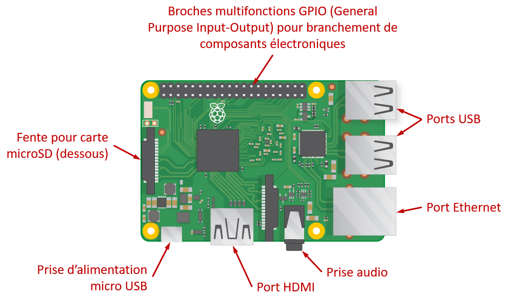

## Faites connaissance avec le Raspberry Pi

Jetons un coup d'œil au Raspberry Pi. Vous devriez avoir un ordinateur Raspberry Pi devant vous. Il ne devrait être branché à rien pour le moment.

### Liste de contrôle d'activité 

Regardez votre Raspberry Pi. Pouvez-vous trouver tous les éléments identifiés sur le diagramme?

+ __Ports USB__ - ceux-ci sont utilisés pour brancher une souris et un clavier USB, de même que d'autres périphériques USB tels qu'une clé de stockage USB.

+ __Fente pour carte microSD__ - la fente pour carte microSD se trouve sous le Raspberry Pi. C'est là que le système d'exploitation et vos fichiers sont stockés.

+ __Port ethernet__ - celui-ci est utilisé pour brancher le Raspberry Pi au réseau (le Raspberry Pi peut aussi être connecté à un réseau Wifi).

+ __Prise audio__ - c'est là que vous branchez des écouteurs ou haut-parleurs.

+ __Port HDMI__ - c'est là que vous branchez le moniteur (ou télévision ou projecteur) que vous utilisez pour afficher la sortie du Raspberry Pi. Si votre moniteur a des haut-parleurs, vous obtiendrez aussi du son.

+ __Prise d'alimentation micro USB__ - c'est là que vous branchez un bloc d'alimentation. Vous devriez toujours brancher celui-ci en dernier.

+ __Broches GPIO__ - celles-ci vous permettent de brancher des composants électroniques tels que des DELs et boutons au Raspberry Pi.

### Défi: Décrivez le Raspberry Pi à un ami

En équipe avec un ami, expliquez tour à tour les différentes parties du Raspberry Pi.