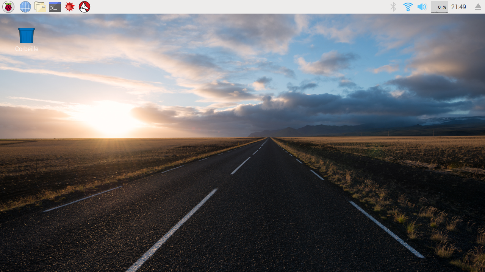

## Branchez votre Pi

Vous allez maintenant brancher votre Raspberry Pi et le démarrer.

+ Vérifiez que votre Raspberry Pi a un carte microSD insérée dans la fente située sous le Pi. Sinon, demandez l'aide de votre leader de club.

	

+ Trouvez le connecteur USB de votre souris.

	Assurez-vous que le symbole USB est sur le dessus et branchez la souris a un port USB du Raspberry Pi. N'importe quel des ports USB convient.

	

+ Branchez le clavier de la même manière.

	

+ Regardez le port HDMI et remarquez qu'il a un côté plat plus long sur le dessus.

	

	Assurez-vous que votre moniteur est branché au secteur et est allumé.

	Branchez le câble du moniteur au port HDMI, en utilisant un adaptateur si nécessaire.

	Rien ne s'affichera pour l'instant.

+ Facultativement, branchez des écouteurs ou haut-parleurs à la prise audio.

+ Facultativement, branchez un câble ethernet d'une prise ethernet au port ethernet du Raspberry Pi. (Vous n'avez pas besoin de ce branchement si vous utiliserez le Wifi pour vous connecter à l'internet.)

+ Remarquez que la prise d'alimentation micro USB a un côté plat plus long sur le dessus.

	Branchez le bloc d'alimentation au secteur et branchez le à la prise d'alimentation micro USB du Raspberry Pi.

	

	Vous devriez voir une lumière rouge sur le Raspberry Pi et des framboises sur le moniteur.

	Le Pi démarrera une interface graphique de bureau.

	