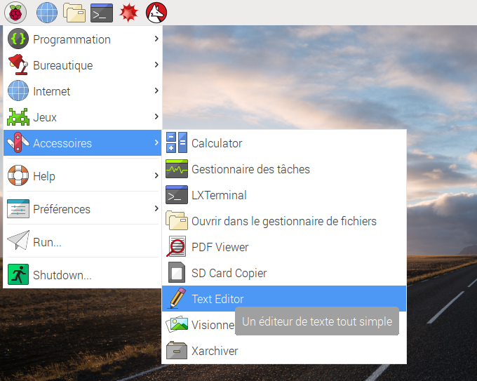
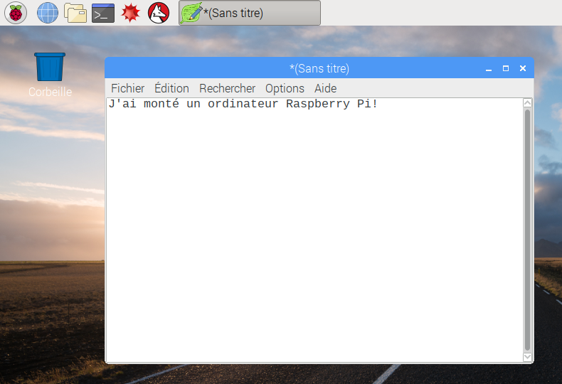
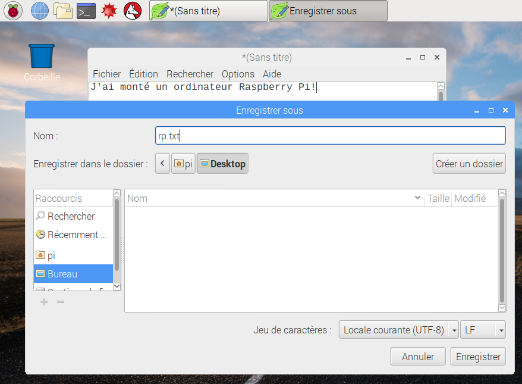
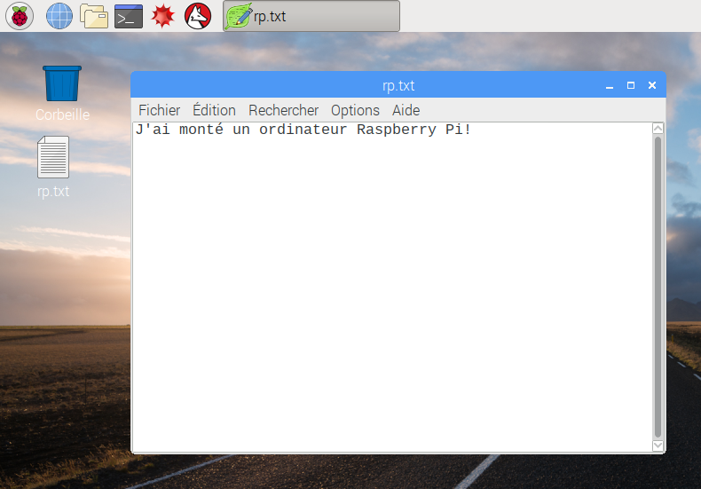
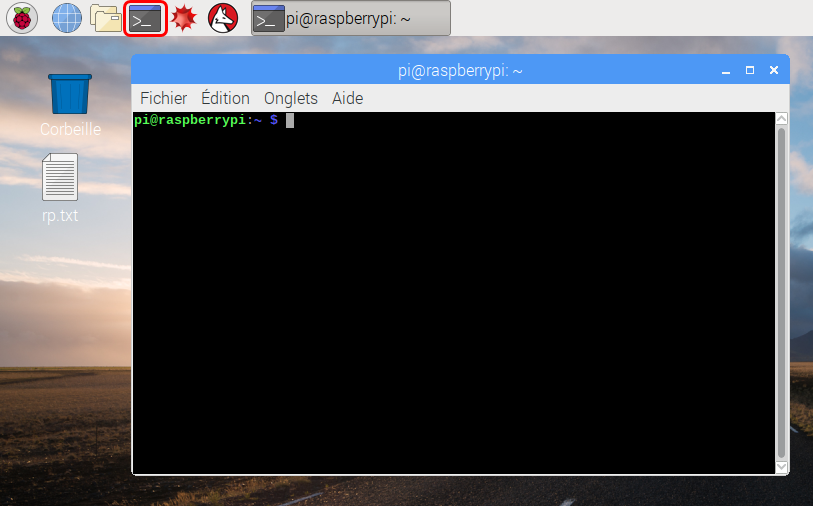
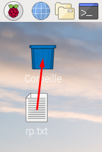

## Une visite du Raspberry Pi

Il est maintenant temps de faire un tour du Raspberry Pi.

+ Vois-tu la framboise dans le coin supérieur gauche? C'est là que tu peux accéder au menu: clique dessus et tu trouveras plein d'applications.

+ Clique sur **Accessoires** et choisis **Éditeur de texte**.

+ Tapes `Je viens de construire un Raspberry Pi` dans la fenêtre qui apparaît.

+ Clique sur **Fichier**, puis choisis **Enregistrer**, puis clique sur **Bureau** et enregistre le fichier sous le nom `rp.txt`.

+ Tu devrais voir une icône nommée `rp.txt` apparaître sur le bureau.

Ton fichier a été enregistré sur la carte SD du Raspberry Pi.

+ Ferme l'éditeur de texte en cliquant sur le **X** dans le coin supérieur droit de la fenêtre.

+ Reviens au menu Framboise, choisis **Éteindre**, puis choisis **Redémarrer**.

+ Une fois que le Pi a redémarré, ton fichier devrait toujours être là.

+ Le Raspberry Pi exécute une version d'un système d'exploitation appelé Linux (Windows et macOS sont d'autres systèmes d'exploitation). Cela te permet d'exécuter des action en tapant des commandes plutôt que de cliquer sur des options de menus. Clique sur le **Terminal** en haut de l'écran:

+ Dans la fenêtre qui apparaît, tape:

    ls
    

puis appuye sur <kbd>Entrez</kbd> sur le clavier.

Cela affichera les fichiers dans votre répertoire `home`.

+ Tape maintenant cette commande de changement de répertoire (en anglais **c**hange **d**irectory) pour aller sur le bureau:

    cd Desktop
    

Tu dois appuyer sur la touche <kbd>Enter</kbd> après chaque commande.

Tape:

    ls
    

Peux-tu voir le fichier que tu as créé ?

+ Ferme la fenêtre du terminal en cliquant sur le **X**.

+ Fais maintenant glisser `rp.txt` dans la Corbeille sur le bureau pour que le Pi soit prêt pour la prochaine personne.
    
    