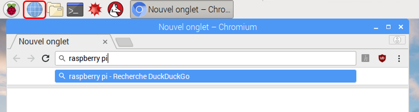

## Surfer sur le web

Tu peux connecter ton Raspberry Pi à Internet. Si tu n'as pas branché un câble ethernet ou connecté via le WiFi durant l'installation, tu ne pourras pas te connecter pour le moment.

+ Clique sur l'icône avec des croix rouges dans le coin supérieur droit de l'écran et sélectionne ton réseau sur le menu déroulant. Tu devras peut-être demander à un adulte quel réseau choisir.

\--- collapse \---

* * *

## title: Paramétrer le pays de la WiFi

Si le message "Définir le pays Wi-Fi dans l'onglet Localisation" s'affiche lorsque tu tentes de te connecter à ton réseau Wi-Fi:

+ Sélectionne **Préférences** puis **Raspberry Pi Configuration** dans le menu.

+ Va à l'onglet **Localisation**.

+ Clique sur le bouton **Définir le pays WiFi**.

+ Sélectionne ton pays dans la liste et clique sur **OK**.

Une fois ton pays Wi-Fi défini, tu peux te connecter à un réseau sans fil.

\--- /collapse \---

+ Met le mot de passe de ton réseau sans fil ou demande à un adulte de le faire pour toi, puis clique sur **OK**.

+ Une fois ton Pi connecté à Internet, tu verras un symbole LAN sans fil à la place des croix rouges.

+ Clique sur l'icône du navigateur Web et recherche `raspberry pi`.

