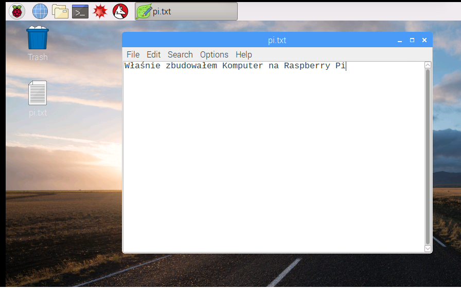

## Wycieczka po Raspberry Pi

Teraz czas na wycieczkę po Raspberry Pi.

+ Widzisz, tą malinę w lewym górnym rogu? To tam masz dostęp do menu: kliknij na niego, a znajdziesz wiele aplikacji.

+ Kliknij **Accessories** i wybierz **Text Editor**.

+ Wpisz `Właśnie zbudowałem Komputer na Raspberry Pi` w oknie, które się pojawi.

+ Kliknij **File**, następnie wybierz **Save**, a następnie kliknij **Desktop** i zapisz plik jako `rp.txt`.

+ Na pulpicie powinna się pojawić ikona o nazwie `rp.txt`.

Twój plik został zapisany na karcie SD Raspberry Pi.

+ Zamknij edytor tekstu, klikając **X** w prawym górnym rogu okna.

+ Wróć do menu Malinowy, wybierz **Shutdown**, a następnie wybierz **Reboot**.

+ Po ponownym uruchomieniu Pi plik powinien nadal tam być.

+ Raspberry Pi uruchamia wersję systemu operacyjnego o nazwie Linux (Windows i macOS to inne systemy operacyjne). Pozwala na robienie rzeczy, wpisując polecenia zamiast klikając na opcje menu. Kliknij **Terminal** u góry ekranu:

+ W wyświetlonym oknie wpisz:

    ls
    

następnie naciśnij <kbd>Enter</kbd> na klawiaturze.

Spowoduje to wyświetlenie listy plików w twoim katalogu `home`.

+ Teraz wpisz to polecenie na **c**hange **d**irectory Desktop. (z ang. zmień katalog na Desktop):

    cd Desktop
    

Po każdym poleceniu musisz nacisnąć klawisz <kbd>Enter</kbd>.

Type:

    ls
    

Czy widzisz plik, który utworzyłeś?

+ Zamknij okno terminala, klikając **X**.

+ Teraz przeciągnij `rp.txt` do kosza na pulpicie, aby Pi było gotowe dla następnej osoby.
    
    