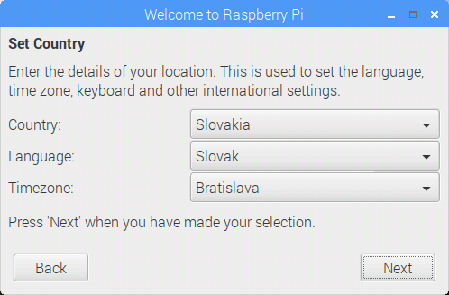

## Dokončenie inštalácie

Keď vaše Raspberry Pi spustíte prvýkrát, spustí sa aplikácia **Welcome to Raspberry Pi** a prevedie vás počiatočným nastavením.

+ Kliknutím na tlačidlo **Next** sa spustí nastavenie.

+ Nastavte svoju krajinu (**Country**), jazyk (**Language**), a časovú zónu (**Timezone**) a znovu kliknite na tlačidlo **Next**.

+ Zadajte nové heslo pre vaše Raspberry Pi a kliknite na tlačidlo **Next**.

+ Pripojte sa k vašej WiFi siete zvolením jej názvu, zadaním hesla a kliknite na tlačidlo **Next**.

**Poznámka:** Ak vaše Raspberry Pi nemá WiFi, túto obrazovku neuvidíte.

+ Kliknite na tlačidlo **Next** a nechajte sprievodcu skontrolovať dostupné aktualizácie pre Raspbian (tento krok môže chvíľu trvať).

+ Pre dokončenie inštalácie kliknite na tlačidlo **Done** alebo **Reboot**.

**Poznámka:** reštart bude potrebný len vtedy, ak je nevyhnutný pre dokončenie aktualizácie.

