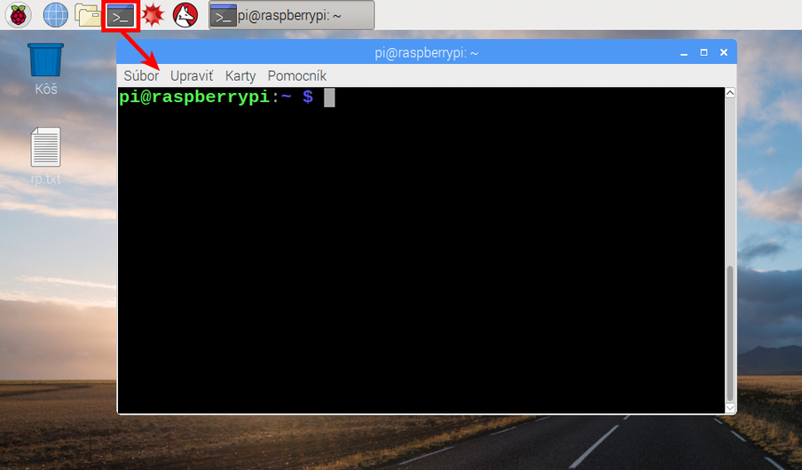

## Prehliadka Raspberry Pi

Nastal čas na prehliadku Raspberry Pi.

+ Vidíte tú malinu v ľavom hornom rohu? To je miesto, kde vstúpite do menu: kliknite na ňu a nájdete veľa aplikácií.

+ Kliknite na položku **Príslušenstvo** a vyberte **Textový editor**.

+ Do okna, ktoré sa zobrazí, napíšte `Práve som oživil Raspberry Pi`.

+ Kliknite na **Súbor**, vyberte položku **Uložiť**, kliknite na **Plochu** a uložte súbor ako `rp.txt`.

+ Mali by ste vidieť ikonu s názvom `rp.txt`, ktorá sa zobrazí na pracovnej ploche.

Váš súbor sa uložil na SD kartu Raspberry Pi.

+ Zatvorte textový editor kliknutím na **X** v pravom hornom rohu okna.

+ Vráťte sa do menu Raspberry, vyberte položku **Vypnúť** a potom vyberte možnosť **Reštartovať**.

+ Po reštartovaní Pi bude váš súbor stále na rovnakom mieste.

+ Raspberry Pi používa operačný systém Linux (Windows a macOS sú iné operačné systémy). Ten vám dovoľuje vykonávať veci písaním príkazov miesto klikania na položky v menu. Kliknite na **Terminál** v hornej časti obrazovky:

+ V okne, ktoré sa zobrazí, zadajte:

    ls
    

a potom stlačte <kbd>Enter</kbd> na klávesnici.

Tento príkaz zobrazí zoznam súborov nachádzajúcich sa vo vašom `domovskom priečinku`.

+ Teraz zadajte tento príkaz na zmenu aktuálneho priečinku (z angl. **c**hange **d**irectory) na pracovnú plochu:

    cd Desktop
    

Po každom príkaze musíte stlačiť kláves <kbd>Enter</kbd>.

Zadajte:

    ls
    

Vidíte súbor, ktorý ste vytvorili?

+ Zatvorte okno terminálu kliknutím na **X**.

+ Teraz presuňte `rp.txt` do Koša na pracovnej ploche, aby bol Pi pripravený pre ďalšieho používateľa.
    
    