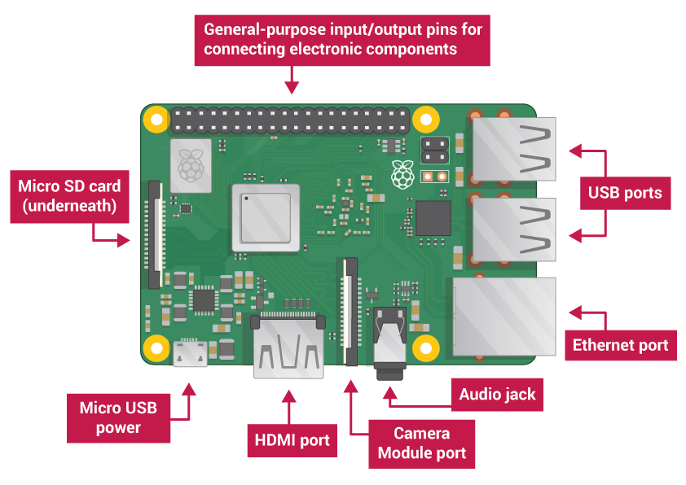

## 了解树莓派

让我们看看树莓派的样子。为此你应该准备一个树莓派在前面。而且它不应该连接任何东西。

+ 看看你的树莓派。你能发现所有在图中标示出来的东西吗？

+ __USB 接口__ — 被用来连接鼠标和键盘。你也可以用它们连接其他组件，比如U盘。

+ __SD 卡槽__ — 你可以把 SD 卡插在这里。这里就是操作系统软件和你的文件存放的地方。

+ __以太网接口__ — 被用来使用网线将树莓派联网。树莓派也能通过无线局域网联网。

+ __音频插口__ — 你可以把耳机和音箱插在这里。

+ __HDMI 接口__ — 这是你连接显示器或投影仪的地方，之后可以在它们上面看到树莓派的输出内容。如果你的显示设备有音箱，你还可以听到声音。

+ __微型 USB 电源接口__ — 这是你连接电源的地方。你应该始终把连接电源作为最后一步，在这之前，要接好所有其他设备。

+ __GPIO 接口__ — GPIO（General-purpose input/output) 通用输入输出接口使你能将电子元器件，比如LED、按钮等，连接到树莓派上，。