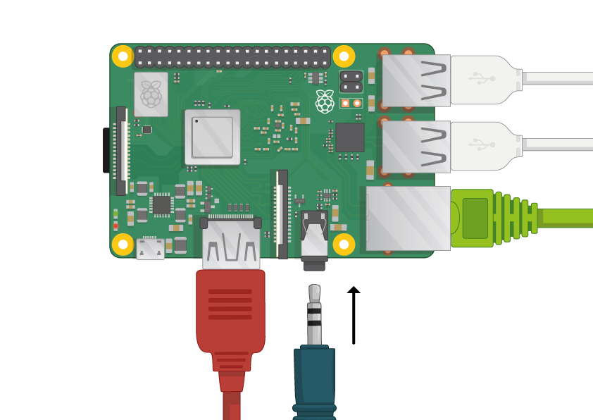
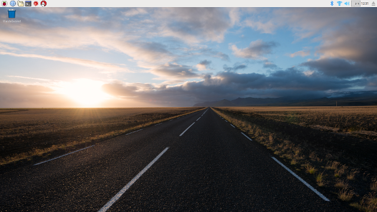

## 连接你的树莓派

让我们连接好树莓派并且使它运行起来。

+ 检查你的树莓派是否在下面的插槽里安装了 SD 卡。如果没有，插入一个安装了 Raspbian 操作系统的 SD 卡。

	

**注意:** 许多微型 SD 卡安装在 SD 适配器里。你可以通过适配器底部凸起的边缘把它拔出来。

[[[noobs-install]]]

+ 找到鼠标的USB接头，将鼠标连接到树莓派的 USB 接口上。（哪个都行）

+ 使用相同的方法连接键盘。

+ 请看树莓派上的 HDMI 接口。注意接口的长边朝上。

确保你的显示器接好电源并且打开。

+ 连接显示器视频线到树莓派的 HDMI 接口。如果不能直接连接（显示器没有 HDMI 接口），可以使用适配器。

现在还不能显示任何东西。

+ 如果你想通过以太网让树莓派联网，使用一根以太网线将树莓派连接到路由器。如果使用 WiFi 上网，就没有必要这么做。

+ 如果你的显示器有扬声器，或者你在音频插孔连接了耳机或者扬声器，就能听到声音了。

+ 注意，微型 USB 电源接口的上边是一个长边。

把电源插入插座，并且将它连接到微型 USB 电源接口上。

现在你应该可以看的在树莓派上的红灯亮起，并且在显示器上看到几个树莓。

树莓派将启动到图形界面。

