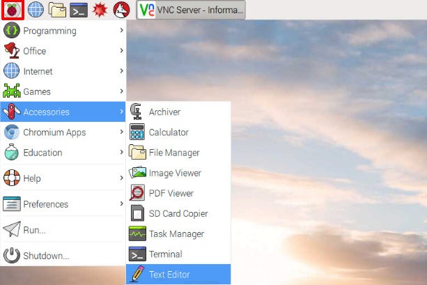

## 参观树莓派

现在是时候参观一下树莓派了。

+ 现在是不是可以在左上角看到树莓派了？那是你访问菜单的地方：点击它，你将发现许多程序。

+ 点击 **附件** 然后选择 **文本编辑器**.

  

+ 在弹出的窗口中输入 `I just built a Raspberry Pi`。

  

+ 点击 **文件**，选择 **保存**，然后点击 **桌面** 将文件保存为 `rp.txt`。

  

+ 你应该在桌面上看到一个名叫 `rp.txt` 的图标。

  

你的文件已经被保存到树莓派的 SD 卡中。

+ 点击窗口右上角的 **X** 关闭文本编辑器。

+ 返回到树莓派的菜单，选择**关机**，然后选择**重启**。

+ 当树莓派重启后，你的文件应该仍然在那里。

+ 树莓派运行着一个叫做 Linux 的操作系统（Windows 和 macOS 是不同的操作系统）。它允许你通过输入命令操作电脑，而不仅是用鼠标点击菜单项。点击在屏幕顶部的**终端**:

  

+ 在弹出的窗口里输入:

```
ls
```

然后按键盘上的 <kbd>Enter</kbd> 键。

这将显示你的 `home` 文件夹的文件。

+ 现在输入下面的命令来“切换目录”（**c**hange **d**irectory）到桌面:

```
cd Desktop
```

每个命令结尾你必须按 <kbd>Enter</kbd> 键。

输入:

```
ls
```

你能看到你创建的那个文件吗？

+ 按 **X** 关闭终端窗口。

+ 现在将`rp.txt`拖到桌面上的回收站，这将使树莓派恢复到初始的状态。

	