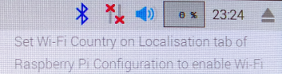
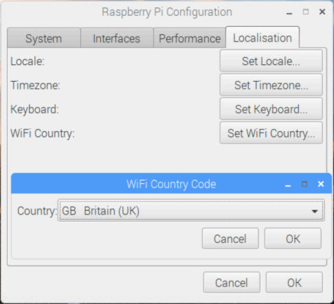
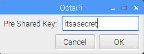
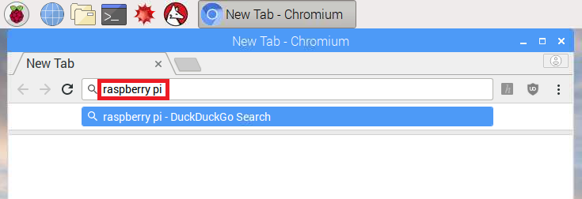

## 浏览网页

你可能想要用树莓派上网。如果你在配置时没有插网线，也没有连接WiFi网络，你可以现在做。

+ 点击屏幕右上角的红叉图标，然后在下拉菜单中选择你的网络。你可能需要问大人你需要选择哪个网络。

--- collapse ---

---
title: 设置 Wi-Fi 国家
---

如果当你尝试连接 Wi-Fi 时看到一条 "Set Wi-Fi Country on Localisation tab" 的信息。

+ 在菜单里选择 **首选项** 然后选 **Raspberry Pi Configuration**。

+ 进入 **Localisation** 标签。

+ 点击**Set WiFi Country** 按钮。

+ 在列表中选择你的国家点击 **OK**.

一旦你的 Wi-Fi 国家设置完成，你就能连接到无线网络了。

--- /collapse ---

+ 为你的无线网络输入密码，或者请大人帮你输入，然后点击**OK**.

+ 当你的树莓派连接到因特网，你将看到一个无线网络图标替换红叉。

+ 点击浏览器图标然后搜索`raspberry pi`。

